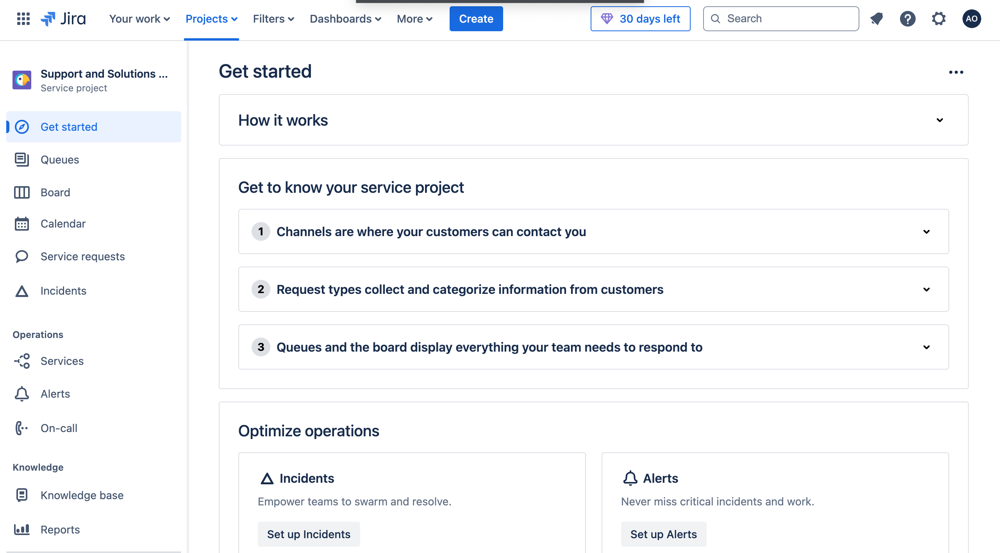
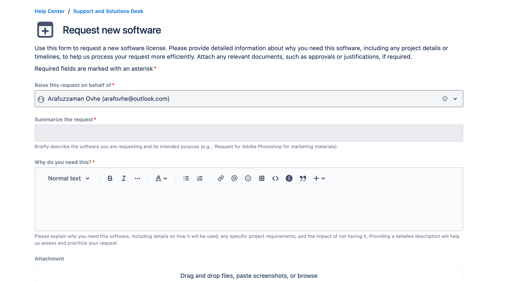
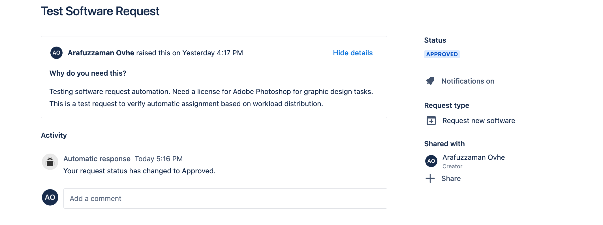
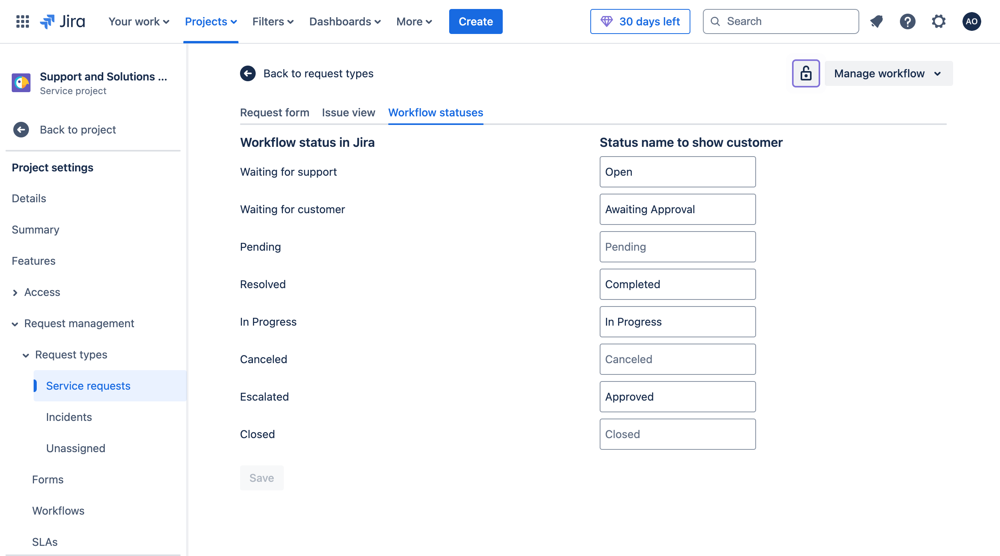

# Help Desk Support System

## Overview
This project simulates a help desk support system using Jira and Confluence, to manage support requests, troubleshooting documentation, and compliance guides. The project demonstrates key skills in configuring request types, workflows, automation, and dashboards to streamline IT support and aimed at improving compliance and support efficiency.

## Project Setup in Jira

## Project Dashboard
This is the initial setup for the Help Desk Support System in Jira's Service Project. Here, we organize support channels, request types, and board queues to streamline customer support processes.

### Custom Request Form: Request New Software
The **Request New Software** form allows users to submit requests for software licenses, providing essential details to ensure efficient processing.

- **Instructions**: Provides guidance on filling out the request.
- **Summary**: Brief description of the requested software and its intended purpose.
- **Description**: Detailed explanation of the need for the software, including usage and impact.

Updated Form

### Request Types
The project includes custom request types to organize and categorize support tasks:
- **Support Request**: For general assistance requests from users.
- **Troubleshooting Guide**: For documenting solutions to common issues.
- **FAQ**: For frequently asked questions.
- **Compliance Documentation**: For documenting policies or guidelines.

### Workflow: Software Request
The **Software Request Workflow** guides each request through stages from submission to completion. This helps track progress and ensures that all necessary approvals are obtained.

- **Open**: The initial status when a request is submitted.
- **In Progress**: The IT team is processing the request.
- **Awaiting Approval**: The request requires managerial or budget approval.
- **Approved**: Approval has been granted, and the request is ready for fulfillment.
- **Rejected**: The request was denied.
- **Completed**: The software has been provided, and the request is closed.

### Custom Fields
To better categorize and track support issues, custom fields were added:
- **Priority Level**: Low, Medium, High, Critical
- **Issue Category**: Hardware, Software, Network
- **Resolution Type**: Temporary, Permanent

### Automation Rules
Automation rules streamline the Software Request Workflow by handling common actions, such as assigning requests, moving requests to awaiting approval, and notifying users about status changes.

- **Auto-Assign New Requests**: Automatically assigns new software requests to a designated team member.
- **Move to Awaiting Approval**: Transitions requests to *Awaiting Approval* when specific criteria are met.
- **Auto-Close Completed or Rejected Requests**: Automatically closes requests after they’re marked as *Completed* or *Rejected* for 3 days.
- **Send Notification on Approval Status Change**: Notifies relevant users when the approval status is updated.

### Dashboard and Reporting
A custom dashboard was set up to monitor key support metrics, showing issue statistics, recent activity, and ticket distribution.

### Sample Issues
Sample issues were created to test support and documentation workflows, each demonstrating the use of custom fields and workflows.

### Knowledge Base Integration with Confluence

1. In Confluence, create a knowledge base with FAQ and troubleshooting guides.
2. Link the Confluence space to the Jira project under **Project Settings > Knowledge Base**.

   - **FAQ Example**: Answer common questions like Wi-Fi connection issues and password resets.

   

   - **Troubleshooting Guide**: Link the guide in Jira issues for direct access.

   

   ## Sample Issue and Resolution Workflow

1. **Create an Issue** - Log an issue such as "Network Connectivity Issue" in Jira.
2. **Add Details** - Include impacted services, urgency, and a description of the problem.
3. **Attach Troubleshooting Guide** - Link to the knowledge base articles directly within the issue to help resolve it faster.

   

